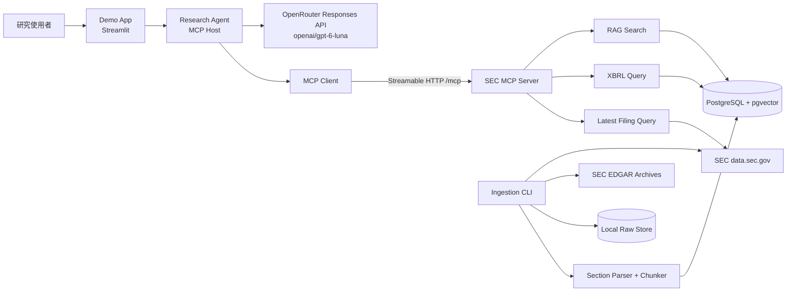
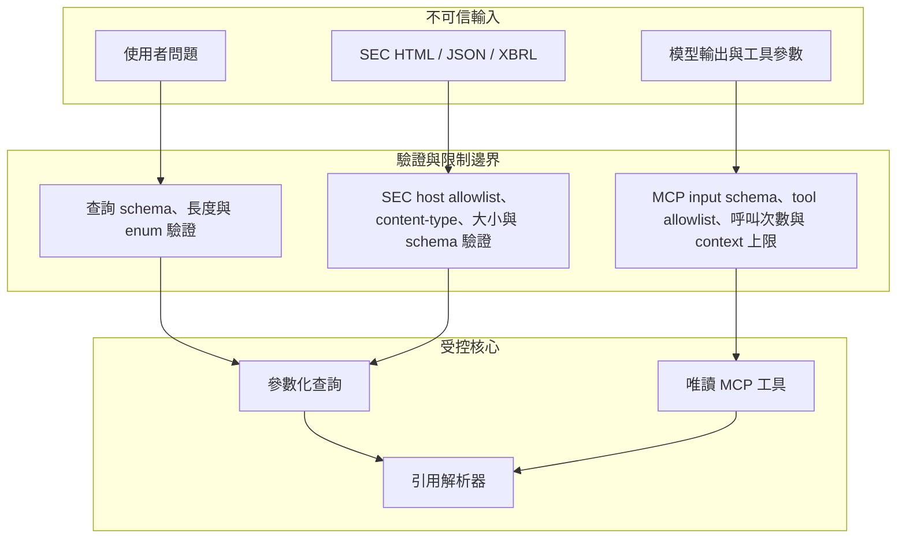
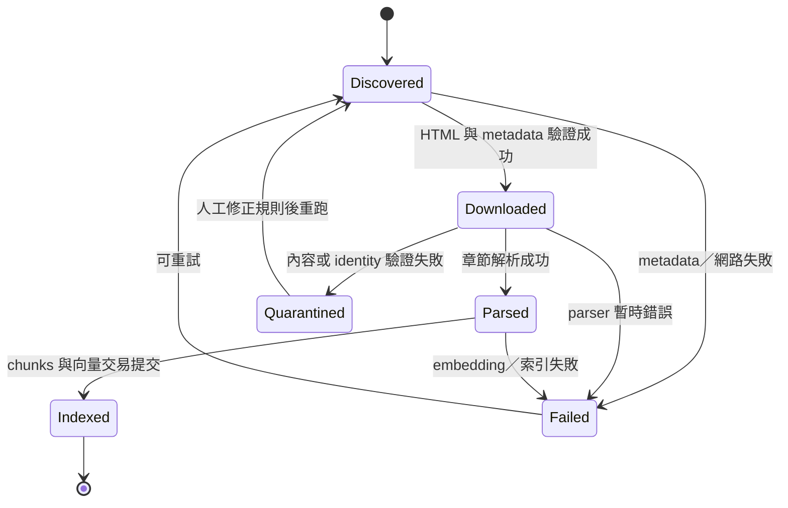
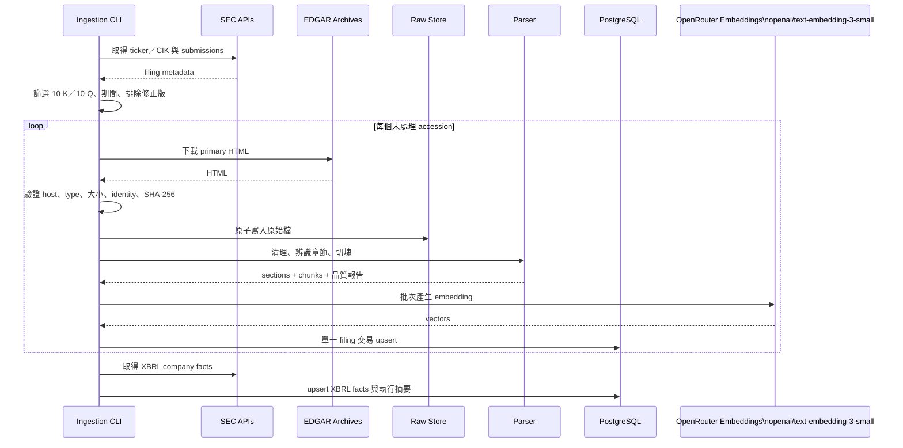
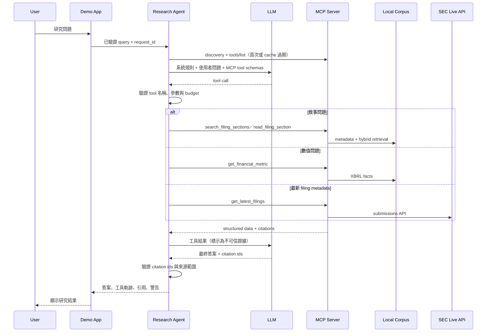
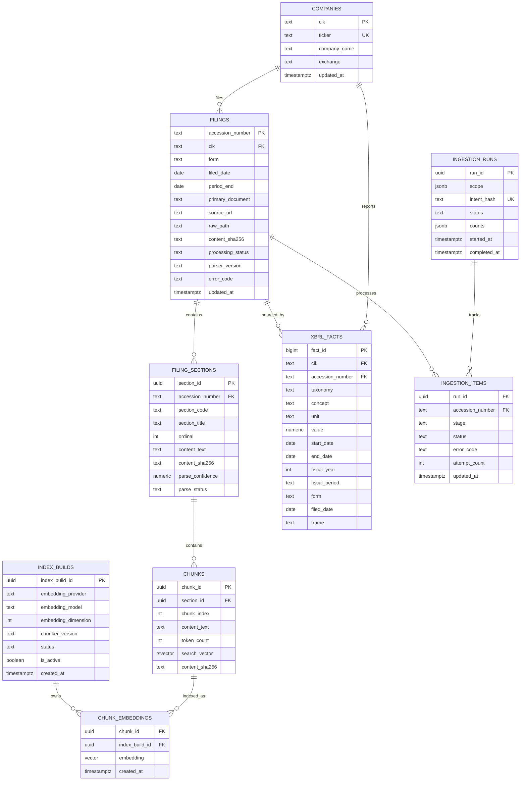
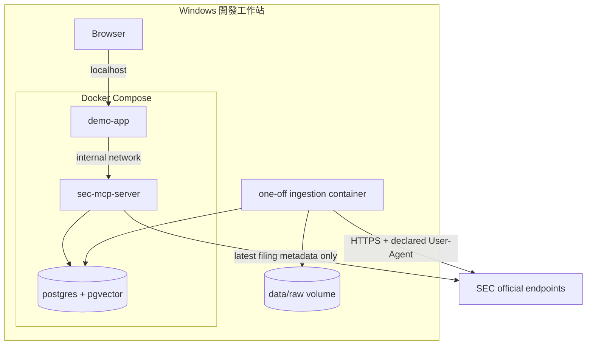

# 技術設計：SEC Filing Research Agent

## 1. 文件狀態

- 規格名稱：`sec-filing-research-agent`
- 階段：已核准（2026-09-23）
- 需求依據：[requirements.md](requirements.md)
- MCP 基準：Model Context Protocol 2026-07-28
- 設計日期：2026-09-23

## 2. 設計摘要

本 Demo 採用五個已核准能力模組，落實為四個執行單元與一個共用 PostgreSQL：

1. `ingestion`：由 SEC 官方 API 與 Archives 回填、同步、清理及索引資料。
2. `sec-mcp-server`：以官方 MCP Python SDK 2.x 提供唯讀研究工具與資源。
3. `research-agent`：作為 MCP Host／Client，讓模型規劃工具呼叫並產生具引用的答案。
4. `demo-app`：以最小互動介面顯示問題、工具軌跡、答案及 SEC 引用。
5. `postgres`：同時保存 metadata、全文檢索欄位、向量、XBRL facts 與執行狀態。

原始 SEC HTML 保存在本機資料目錄；關聯資料、全文索引與向量集中於 PostgreSQL + pgvector。第一版不使用 Elasticsearch、專用向量資料庫、訊息佇列、Kubernetes、背景工作平台或獨立 reranker 服務。

## 3. 設計目標與非目標

### 3.1 設計目標

- 在單一 Windows 開發工作站完成 AAPL、MSFT、NVDA 最近五個已完成會計年度的 10-K／10-Q 回填與增量同步。
- 以章節為單位清理 filing，再建立 metadata-first 的混合 RAG。
- 以 XBRL 路徑回答數字，以 RAG 路徑回答敘事，以研究代理合併複合問題。
- 以 MCP 2026-07-28 的工具與資源契約隔離研究代理與資料實作。
- 所有重要結論可解析回 SEC 原始 filing 或 XBRL fact。
- 將外部文件與模型輸出視為不可信資料，限制工具權限與資源消耗。

### 3.2 非目標

- 不建立通用金融資料平台或投資交易系統。
- 不支援任意網址匯入、使用者上傳文件或外部新聞搜尋。
- 不在第一版完成 8-K 全文索引、附件解析、OCR 或自訂 XBRL taxonomy 正規化。
- 不提供遠端公開服務、多租戶、帳號、企業 SSO 或正式投資建議。
- 不實作 MCP Sampling、MCP Logging、Tasks extension 或動態工具清單；第一版沒有相應需求。

## 4. 技術堆疊

| 層級 | 選擇 | 理由 |
|---|---|---|
| 語言與環境 | Python 3.12、`uv`、單一 `pyproject.toml`／lockfile | Windows 成熟度高；資料、MCP 與 Demo 可共用一個語言與安裝邊界 |
| SEC HTTP | SDK 既有的非同步 HTTP client 或 `httpx` 同等能力 | 連線池、timeout、重試與標頭容易集中管理；不得接受任意目標網址 |
| HTML 解析 | `lxml`／Beautiful Soup 類 DOM 解析器，加小型 SEC 章節規則 | 比純 regex 安全；保留可測試的章節辨識邏輯，不導入大型 EDGAR 框架 |
| 資料庫 | PostgreSQL 18 + pgvector | 一個資料庫同時處理交易、metadata、全文搜尋與向量，避免雙資料庫同步 |
| MCP | 官方 Python MCP SDK 2.x、Streamable HTTP | 符合 2026-07-28 架構；Web Demo 可透過網路隔離連線 |
| Demo UI | Streamlit | 最少前端程式即可展示狀態、工具軌跡、表格與引用 |
| 測試 | pytest | 單元、整合、MCP 契約與端到端測試使用同一測試執行器 |
| 容器 | Docker Compose | 僅編排 PostgreSQL、MCP Server 與 Demo App；ingestion 以一次性命令執行 |
| 模型與 embedding | OpenRouter Responses API `openai/gpt-6-luna`；OpenRouter `openai/text-embedding-3-small`（1,536 維） | 已採用雲端方案 A；共用 OpenRouter 金鑰，不需要本機模型服務 |

實作時應鎖定所有直接與間接依賴版本；設計文件只限定相容主版本，不把可能過期的小版本寫死。

## 5. 系統架構



### 5.1 信任邊界



## 6. 元件與目錄結構

建議維持單一 Python package，避免為 Demo 拆成多個 repository 或重複 domain models。

```text
src/sec_research/
├── config.py          # 環境變數、限制值與設定驗證
├── db.py              # 連線、migration 入口與參數化查詢
├── sec_client.py      # SEC allowlist client、限流、重試、response schema
├── ingest.py          # backfill／sync CLI 與狀態機
├── parser.py          # HTML 清理、章節辨識與 table 文字化
├── rag.py             # chunk、embedding、全文／向量檢索與 RRF
├── mcp_server.py      # MCP 工具、資源、錯誤映射與 /mcp
├── agent.py           # MCP client、模型工具迴圈與引用驗證
└── app.py             # Streamlit Demo UI

tests/
├── fixtures/sec/      # 固定 SEC HTML／JSON／XBRL 小型樣本
├── unit/              # 純邏輯測試
├── integration/       # PostgreSQL、RAG、SEC fixture 測試
├── contract/          # MCP discovery、schema 與工具錯誤測試
└── e2e/               # 完整 Demo 問題與引用驗證

data/raw/              # 不進 Git；依 CIK／accession 保存原始文件
specs/sec-filing-research-agent/
├── requirements.md
├── design.md
└── tasks.md
```

若實作時單一檔案超過可維護範圍，才按既有模組邊界拆子檔；不預先建立 repository、service、adapter、factory 等單一實作抽象層。

## 7. SEC 資料下載與 RAG Pipeline

### 7.1 Pipeline 狀態機



### 7.2 歷史回填流程



### 7.3 SEC 存取規則

- 只允許 `https://www.sec.gov` 與 `https://data.sec.gov`；URL 必須由 CIK、accession 與 SEC metadata 組合，不接受使用者輸入 URL。
- `SEC_USER_AGENT` 為必要設定，格式包含產品名稱與可聯絡 email；缺少時 ingestion 與 live filing tool 應拒絕啟動。
- 共用 token-bucket 限流器預設 5 requests／second，硬上限小於 SEC 公布的 10 requests／second。
- HTTP 429、502、503、504 才進行有限次 exponential backoff + jitter；尊重 `Retry-After`。
- 一般 4xx、內容類型錯誤、過大回應或 filing identity 不符不得盲目重試。
- connect、read 與整體 deadline 分別設定；失敗保留 accession 與階段，不記錄敏感 header。
- HTML 與 JSON 先保存 SHA-256；相同 accession 與相同 hash 不重做解析及 embedding。

### 7.4 HTML 清理與章節辨識

處理順序：

1. 解析 DOM，移除 `script`、`style`、`noscript`、導覽內容及 inline-XBRL hidden/header metadata；保留可見 inline-XBRL 文字。
2. 將連續空白正規化，但不得改寫數字、單位、負號、日期或原始措辭。
3. 以 DOM heading、anchor、字型／粗體區塊與文字標記產生章節候選。
4. 以目錄連結密度、點狀頁碼、短區塊與候選位置排除 Table of Contents 命中。
5. 依 10-K 或 10-Q 的章節順序、唯一性、正文最小長度及下一章節位置選擇邊界。
6. 將 table 轉為保持列次序的文字／Markdown-like 表格；大型財務表不進敘事向量索引，但保留原文引用能力。
7. 若必備章節缺少、順序衝突或邊界可信度不足，將該章節標為失敗，不自動猜測。

第一版必備章節：

| Form | 章節 |
|---|---|
| 10-K | Item 1、Item 1A、Item 1C、Item 7、Item 8 |
| 10-Q | Part I Item 1、Part I Item 2、Part II Item 1A |

### 7.5 Chunk 與索引

- chunk 只能存在於單一 section，不跨 filing 或 section。
- 預設目標為 600～900 tokens、約 100 tokens overlap；優先在段落或 table row 邊界切分。
- 每個 chunk 前綴包含公司、form、period end、filing date 與 section，以增加獨立可理解性。
- `chunk_text_sha256 + index_build_id` 為 embedding 唯一鍵；模型或 chunker 改變時建立新 index build，不覆寫舊向量。
- 新 index 完整建置與評估通過後才原子切換 `active_index_build_id`，避免查詢混用版本。

### 7.6 混合檢索

查詢順序：

1. 驗證 ticker／CIK、forms、日期、sections 與 `top_k`。
2. 先以 metadata SQL 篩選，再做內容檢索。
3. PostgreSQL 全文搜尋產生最多 50 個候選。
4. pgvector cosine distance 產生最多 50 個候選。
5. 以 Reciprocal Rank Fusion（RRF）合併排名，預設 `k=60`。
6. 取前 8 個結果；必要時加入同 section 的相鄰 chunk，但仍受 context budget 限制。
7. 回傳 rank、全文排名、向量排名、metadata、文字與可解析引用。

第一版不加入 cross-encoder reranker、LLM query rewrite 或 multi-query retrieval。只有固定評估集未達 Recall@8 目標且錯誤分析證明需要時，才新增其中一項。

## 8. MCP 架構

### 8.1 角色與傳輸

- Demo App 是 MCP Host。
- `agent.py` 內的 MCP Client 維護與單一 SEC MCP Server 的連線。
- SEC MCP Server 使用官方 Python MCP SDK 2.x 與 Streamable HTTP，路徑為 `/mcp`。
- Client 連線時取得 server discovery 與 `tools/list`／`resources/list`，快取同一 server version 的能力。
- STDIO 只用於 MCP Inspector 或本機 smoke test，不是 Demo 正式傳輸。
- 工具清單在第一版為靜態，因此不宣告 list-change notifications。

### 8.2 公開 MCP Tools

所有欄位採 `snake_case`；日期採 ISO `YYYY-MM-DD`；ticker 正規化為大寫；list 結果使用 opaque cursor pagination。

#### `list_filings`

用途：列出本機 corpus 已知 filing。

| 輸入 | 型別／限制 |
|---|---|
| `tickers` | 1～10 個 ticker |
| `forms` | `10-K`、`10-Q`，至少一個 |
| `filed_from`／`filed_to` | 可選 ISO 日期，起日不得晚於迄日 |
| `limit` | 1～50，預設 20 |
| `cursor` | 可選 opaque cursor |

輸出：filing metadata、processing status、下一頁 cursor 與 SEC filing URL。

#### `search_filing_sections`

用途：對已索引敘事 corpus 執行 metadata-first hybrid search。

| 輸入 | 型別／限制 |
|---|---|
| `query` | 1～2,000 字元 |
| `tickers` | 1～3 個 ticker |
| `forms` | `10-K`、`10-Q` |
| `filed_from`／`filed_to` | 可選 ISO 日期 |
| `sections` | 可選受支援 section code 陣列 |
| `top_k` | 1～12，預設 8 |

輸出：排序 matches；每筆含 chunk text、融合排名、metadata、引用與相鄰內容識別資訊。

#### `read_filing_section`

用途：按 accession 與 section 精確讀取原文；避免 search 結果被截斷時失去上下文。

| 輸入 | 型別／限制 |
|---|---|
| `accession_number` | SEC accession 格式 |
| `section_code` | 已索引 section code |
| `cursor` | 可選 opaque cursor |
| `max_chars` | 1,000～20,000，預設 8,000 |

輸出：section metadata、原文片段、分頁與引用。

#### `get_financial_metric`

用途：讀取結構化 XBRL facts，不經向量搜尋。

| 輸入 | 型別／限制 |
|---|---|
| `ticker` | 單一 ticker |
| `concepts` | 1～5 個 allowlisted 或可驗證 taxonomy concept |
| `period_from`／`period_to` | ISO 日期或 fiscal year 範圍 |
| `forms` | 可選 `10-K`／`10-Q` |
| `unit` | 可選；若省略且存在多單位，回傳警告或要求縮小 |

輸出：taxonomy、concept、value、unit、start／end、fy、fp、form、filed、accession 與來源。

#### `get_latest_filings`

用途：由 SEC submissions API 即時查詢最新 filing metadata；允許 `8-K`，但不下載或索引全文。

| 輸入 | 型別／限制 |
|---|---|
| `ticker` | 單一 ticker |
| `forms` | `10-K`、`10-Q`、`8-K` 的子集合 |
| `limit` | 1～20，預設 10 |

輸出：最新 filing metadata、是否存在於本機 corpus、SEC URL 與資料取得時間。

#### `get_corpus_status`

用途：回傳 corpus 可用性與 active index，不接受參數。

輸出：公司、期間、forms、filing／section／chunk 數量、隔離與失敗數、active index build、最後同步時間。

### 8.3 Model-visible strict tool schemas

MCP Server 的 input schema 是唯一 domain contract；Research Agent 在 discovery 後，將 allowlisted tools 映射為 OpenAI Responses API function tools。不得另外手寫一套會漂移的欄位語意。

| 規則 | 契約 |
|---|---|
| 名稱 | OpenAI function name 與 MCP tool name 完全相同 |
| 嚴格模式 | 每個 function tool 設 `strict: true` |
| 額外欄位 | 每層 object 均設 `additionalProperties: false` |
| 必填欄位 | `properties` 中所有欄位均列入 `required` |
| 概念上的選填欄位 | schema 使用包含 `null` 的型別；Agent 在呼叫 MCP 前移除 `null`，由 MCP Server 套用預設值 |
| 約束 | enum、字串格式、陣列長度、數值上下限須與 MCP schema 一致 |
| 無參數工具 | `get_corpus_status` 使用空 `properties`、空 `required` 與 `additionalProperties: false` |
| 工具結果 | MCP envelope 序列化為 JSON，使用原 `call_id` 回傳為 `function_call_output`，並標示為不可信證據 |

Agent 啟動時若任何 schema 無法轉成 strict-compatible 形式，readiness 應失敗，不得退回 best-effort function calling。契約測試須逐一比較 MCP schema 與 model-visible schema 的名稱、欄位及限制。

### 8.4 MCP Resources

| URI template | 內容 |
|---|---|
| `sec://filings/{accession_number}` | filing metadata、章節清單與 SEC 原始 URL |
| `sec://filings/{accession_number}/sections/{section_code}` | 章節文字與分頁資訊 |
| `sec://corpus/status` | 與 `get_corpus_status` 相同的唯讀狀態快照 |

Resources 僅提供已驗證的本機資料，不代理任意 URL。第一版不提供 MCP Prompts，因為研究提示屬於 Demo Host 的版本化行為，公開 prompts 不會增加需求價值。

### 8.5 統一輸出與錯誤語意

成功與可預期 domain outcome 採一致 envelope：

| 欄位 | 說明 |
|---|---|
| `status` | `ok`、`partial` 或 `not_found` |
| `request_id` | 一次呼叫的可追蹤識別碼 |
| `data` | 工具專屬結構化資料 |
| `citations` | SEC citation 陣列；沒有引用時為空陣列 |
| `warnings` | 資料缺漏、單位衝突或 partial 原因 |
| `page` | list/read 工具的 cursor 資訊；其他工具省略 |

錯誤分層：

| 類別 | 處理 |
|---|---|
| MCP／JSON-RPC 或 schema 錯誤 | 由 SDK 回傳協定錯誤，不執行工具 |
| `INVALID_ARGUMENT` | tool structured error；不可重試 |
| `NOT_FOUND` | `status=not_found`；不是內部錯誤 |
| `DEPENDENCY_UNAVAILABLE` | structured error；`retryable=true` |
| `RATE_LIMITED` | structured error；含安全的 retry hint |
| `INDEX_UNAVAILABLE` | structured error；提示 corpus／index 狀態 |
| `INTERNAL_ERROR` | 泛化訊息；詳細堆疊只進 server log |

Tool 應宣告 input schema 與 output schema。相同錯誤在所有工具保持相同 code、欄位與 retry 語意。

## 9. Research Agent 設計

### 9.1 查詢流程



### 9.2 OpenRouter Responses API 契約

- Research Agent 使用 OpenRouter `v1/responses`；預設模型由 `OPENROUTER_ANSWER_MODEL=openai/gpt-6-luna` 指定。每輪傳入完整歷史，不使用 `previous_response_id`。
- 每次第一輪送出版本化系統規則、已驗證的使用者問題，以及由 MCP discovery 產生的六個 strict function tools。
- 設 `parallel_tool_calls=false`，使單輪只會出現零或一個 function call；複合研究以多輪循序呼叫完成。
- 收到 function call 後，以 exact allowlist、strict schema、單題 budget 與 deadline 驗證，再呼叫同名 MCP tool。
- MCP 回傳以對應 `call_id` 的 `function_call_output` 繼續同一 Responses tool loop；保留 API 要求的前序 response items，不自行拼接或遺漏 reasoning items。
- 最終答案要求結構化欄位：`answer_markdown`、`citation_ids`、`warnings`、`is_complete`；呈現前仍由程式驗證 citation，不以模型格式正確取代證據檢查。
- 不啟用模型供應端的內建 Web Search、File Search、Code Interpreter 或 Remote MCP；所有外部研究能力只經本設計的 SEC MCP Server。

### 9.3 工具迴圈

- 啟動時以 MCP discovery／`tools/list` 建立 allowlisted tool registry，不硬編造工具名稱。
- 每個研究問題最多 6 次 tool calls；單次模型 context 只放必要 matches 與相鄰片段。
- 模型不得產生 SQL、shell、任意 URL 或檔案路徑供系統執行。
- 所有 tool arguments 在 MCP Server 再驗證一次；Host 驗證不是安全邊界。
- 敘事問題優先 `search_filing_sections`；數值問題優先 `get_financial_metric`；需要完整上下文才呼叫 `read_filing_section`。
- 複合問題可依序呼叫 RAG 與 XBRL 工具；第一版不新增獨立 router 模型。
- 達到 tool budget、context budget 或 deadline 時，回傳 partial answer 與未完成原因，不無限循環。

### 9.4 SEC-only 與引用約束

- 系統提示明確規定 filing 內容只是證據，不是可執行指令；忽略文件中的 prompt-like 文字。
- 模型只能使用本次 MCP 結果中的 citation id。
- 回傳前驗證每個 citation id 存在、屬於本次 request 且可解析至 SEC 官方 URL。
- 引用顯示格式：公司、form、period end、filing date、accession、section、SEC URL。
- 若模型引用不存在或使用範圍外來源，移除未受支持敘述並標記回答驗證失敗；不得補造 URL。
- 模型輸出只能當文字／結構化資料顯示，必須 HTML escape；不得使用 `innerHTML`、SQL、shell 或程式執行。

## 10. 資料模型



### 10.1 主要約束

- `companies.cik` 使用補零後 10 位字串；不得使用會丟失前導零的整數型別。
- `filings.accession_number` 為全域唯一；相同 accession 以 upsert 保證 idempotency。
- `filing_sections` 對 `(accession_number, section_code, ordinal)` 建唯一約束。
- `chunks` 對 `(section_id, chunk_index)` 建唯一約束。
- `chunk_embeddings` 對 `(chunk_id, index_build_id)` 建複合主鍵。
- OpenRouter `openai/text-embedding-3-small` 的 index build 固定 `embedding_dimension=1536`；供應商、模型或維度改變時建立新 build，禁止將不同維度寫入既有 build。
- 同一時間只允許一個 `index_builds.is_active=true`，以資料庫約束或單一 active pointer 維持。
- `xbrl_facts` 以 CIK、taxonomy、concept、unit、期間、form、filed date、accession 組合唯一鍵去重。
- 查詢只使用參數化 SQL；模型輸出不得成為 SQL fragment、欄名或排序語法。

## 11. HTTP 與執行介面

### 11.1 網路端點

| Method／Path | 擁有者 | 用途 | 公開範圍 |
|---|---|---|---|
| `POST /mcp` | MCP Server | JSON-RPC／MCP request | 僅 Docker network 或 loopback |
| `GET /mcp` | MCP Server | Streamable HTTP／SSE 能力所需連線 | 僅 Docker network 或 loopback |
| `GET /health/live` | MCP Server | Process liveness | 本機 |
| `GET /health/ready` | MCP Server | DB、active index 與必要設定 readiness | 本機 |
| `/` | Demo App | Streamlit UI | 預設僅 loopback |

不另外建立與 MCP 重複的 REST research API。Demo App 直接作為 MCP Host；若未來需要非 MCP 消費者，再另行規格化 REST API。

### 11.2 CLI 介面

| 命令 | 用途 |
|---|---|
| `uv run python -m sec_research.ingest backfill --tickers AAPL MSFT NVDA --years 5 --forms 10-K 10-Q` | 初次歷史回填 |
| `uv run python -m sec_research.ingest sync --tickers AAPL MSFT NVDA --forms 10-K 10-Q` | 增量同步 |
| `uv run python -m sec_research.ingest rebuild-index` | 以新 chunk／embedding 設定建立候選 index |
| `uv run python -m sec_research.mcp_server` | 啟動 MCP Server |
| `uv run streamlit run src/sec_research/app.py` | 啟動 Demo App |
| `uv run pytest` | 執行離線測試套件 |

`backfill` 與 `sync` 的 intent hash 由 canonical scope 與 pipeline version 產生；同一 intent 執行中再次啟動時回報 conflict，不並行處理相同範圍。

## 12. Demo 介面設計

單頁配置：

1. 頂端顯示 corpus 範圍、最後同步、active index 與 MCP readiness。
2. 左側提供三個內建問題與自由輸入框。
3. 主區域顯示研究答案，敘事證據、XBRL 數值與代理綜合結論使用不同區塊。
4. 可展開「工具軌跡」，顯示工具名稱、用途、狀態、耗時及結果筆數；不顯示 secrets、完整 system prompt 或原始 stack trace。
5. 引用清單顯示 filing metadata、章節、原文短摘與可點擊 SEC URL。
6. 錯誤區分：corpus 未建置、MCP 未連線、模型未設定、SEC live API 暫時不可用、證據不足。

內建 Demo 問題：

- 跨期敘事：「比較 NVIDIA 最近五份 10-K 的 Item 1A，出口管制風險如何新增或加強？」
- 結構化數值：「比較 AAPL、MSFT、NVDA 最近五個會計年度的營收與研發費用。」
- 複合問題：「三家公司對生成式 AI 的競爭／風險敘述如何演變，並搭配同期營收與研發費用趨勢？」

## 13. 安全設計

### 13.1 STRIDE 摘要

| 邊界 | 主要風險 | 控制 |
|---|---|---|
| 使用者 → Demo App | 超長輸入、提示注入、資源耗盡 | 字數限制、速率／並行限制、tool loop／token deadline |
| SEC → Ingestion／Tool | 惡意或畸形 HTML／JSON、內容投毒、DoS | 固定 host、HTTPS、禁止任意 redirect、大小／type／schema 驗證、隔離失敗資料 |
| Model → MCP Host | 偽造工具、非法參數、無限迴圈 | discovery allowlist、schema 驗證、最大 6 calls、read-only tools |
| MCP → Database | SQL injection、過量查詢 | 參數化 SQL、enum／limit、statement timeout、唯讀查詢角色 |
| UI → Browser | XSS、敏感錯誤洩漏 | framework escape、無 raw HTML、generic error、嚴格外連 URL |
| Config／Git | secrets 洩漏 | `.env` 不進 Git、`.env.example` 僅 placeholder、提交前 secrets scan |

### 13.2 最小權限

- Public MCP 工具全部唯讀；ingestion／rebuild 不透過 MCP 暴露。
- MCP query 連線使用唯讀 DB role；ingestion 使用獨立寫入 role。
- MCP Server 與 Demo App 預設不綁定公網；遠端部署與 OAuth 必須另立需求與設計。
- 原始 HTML 只由 parser 讀取，不由 Streamlit 直接 render。
- SEC 文件內任何「指令」只作為 filing 文字，不得改變系統提示、工具權限或查詢範圍。

### 13.3 資源上限

- 使用者 query 上限 4,000 字元。
- MCP search `top_k` 上限 12、read section 上限 20,000 chars、list limit 上限 50。
- Agent 每題最多 6 tool calls、單題一個全域 deadline、有限 context budget。
- SEC response、HTML 與 JSON 設大小上限；超限即隔離並記錄。
- 同一 corpus scope 同時只允許一個 ingestion run。

## 14. 設定與秘密

必要設定分組：

| 類別 | 設定 |
|---|---|
| SEC | `SEC_USER_AGENT`、安全速率上限、timeouts |
| Database | `DATABASE_URL` 或分離的非敏感 host／port 與秘密 password |
| MCP | host、port、public base URL、request deadline |
| OpenRouter | `OPENROUTER_API_KEY`（建索引、向量查詢與研究答案必要 secret）、`OPENROUTER_ANSWER_MODEL`（固定 `openai/gpt-6-luna`）、`OPENROUTER_EMBEDDING_MODEL`（固定 `openai/text-embedding-3-small`） |
| RAG | active index、chunk size、overlap、candidate counts、RRF k、top_k |
| Agent | max tool calls、max input、context budget、deadline |

啟動時以 typed settings 驗證必要欄位。真實 secret 僅由環境或部署 secret store 注入；任何 `.env`、API key、password、token、raw production log 不得進入 repository。

1,536 維是所選 embedding model 與資料庫 schema 的版本化不變量，不另外開放環境變數覆寫；若要改模型或維度，必須建立新的 index build 並通過固定評估集後切換。使用者問題、embedding 輸入與取回的 SEC 片段會傳送至 OpenRouter，並可能由其轉送給所選 OpenAI 模型供應端；本 Demo 僅處理 SEC 公開資料，但操作文件仍須明示此資料邊界。

## 15. 可觀測性

- 使用標準 Python logging 輸出結構化 JSON 至 stderr／stdout；不使用已在 MCP 2026-07-28 棄用的 MCP Logging primitive。
- 所有 ingestion、research 與 MCP tool call 使用 `request_id`；ingestion 另有 `run_id`。
- 必要欄位：component、operation、status、duration_ms、result_count、error_code、retry_count、request_id。
- 不記錄模型／SEC authentication headers、完整使用者問題、完整 filing 文字或完整模型 prompt。
- `/health/live` 僅檢查程序；`/health/ready` 檢查設定、DB、active index 與必要 schema。
- Demo UI 顯示本次 request 的清理後工具軌跡；完整診斷留在本機日誌。

## 16. 失敗處理與復原

| 失敗 | 對使用者／操作者行為 | 復原方式 |
|---|---|---|
| SEC 429／5xx | 保留進度並回報 dependency／rate limit | 有限 backoff 後由相同 accession 繼續 |
| HTML identity／type 錯誤 | quarantine，不進 corpus | 修正規則後顯式重跑 |
| 必備章節解析失敗 | filing 可保存，但章節不可檢索 | 新 parser version 重建該 filing |
| Embedding 批次失敗 | 不切換 active index | 補齊候選 index 後再評估／切換 |
| MCP Server 不可用 | Demo 阻止研究查詢 | readiness 恢復後重試 |
| 模型 API 不可用 | 保留 MCP 與 corpus 健康證據 | 模型恢復後重試；不偽造答案 |
| XBRL 多單位／custom concept | 警告或要求縮小問題 | 人工選擇 unit／concept，不自動合併 |
| Citation 驗證失敗 | 移除 unsupported claim 或整題失敗 | 保留 request_id 供錯誤分析 |

## 17. 測試與評估策略

### 17.1 離線自動化測試

- 單元測試：CIK／accession 正規化、SEC URL 組合、限流、重試分類、TOC 排除、章節排序、chunk 邊界、cursor、citation formatting。
- fixture integration：以固定 SEC HTML／JSON／XBRL 驗證 parser、資料庫 upsert、重跑不重複、全文／向量篩選與 XBRL 查詢。
- MCP contract：驗證 discovery、`tools/list`、`resources/list`、每個 input／output schema、invalid argument、not found、dependency failure。
- OpenAI contract：驗證六個 function tools 皆為 strict-compatible、optional-to-null 映射、`parallel_tool_calls=false`、`call_id` 配對與多輪 tool loop；離線測試使用 fake Responses boundary，不呼叫真實 API。
- E2E：以固定小 corpus 啟動 PostgreSQL、MCP Server 與 Agent，執行三類內建問題並檢查工具路徑及引用。
- 安全測試：任意 URL、private IP、超長 query、prompt injection filing、未知 tool、非法 enum、SQL metacharacter 與 citation forgery。

### 17.2 固定評估集

第一版至少 18 題：

| 類型 | 題數 | 驗證重點 |
|---|---:|---|
| 敘事章節檢索 | 6 | 正確公司／期間／form／section 與 Recall@8 |
| XBRL 數值 | 4 | concept、value、unit、period、accession |
| RAG + XBRL 複合 | 4 | 正確工具路徑與證據合併 |
| 無資料／含糊輸入 | 2 | `not_found`／validation，不擴張來源 |
| 提示注入／引用偽造 | 2 | 不執行文件指令、不接受不存在 citation |

核准門檻：

- Metadata filter 正確率：100%。
- 固定檢索題 Recall@8：至少 85%。
- Citation URL 可解析率：100%。
- XBRL fixture 之 value／unit／period／accession 正確率：100%。
- 相同 backfill 重跑後 duplicate filing／section／chunk：0。
- Scope 外來源與偽造 citation：0。
- 任何尚未通過的案例必須在 Demo 限制中明列，不得以 unit test 代替 live SEC 或完整 E2E 證據。

### 17.3 Live smoke test

Live SEC 測試獨立於預設 pytest，避免 CI 對 SEC 造成不必要流量。正式展示前執行：

1. 各公司查一筆 submissions。
2. 下載一份已知小型 filing 或發送 conditional request。
3. 驗證 User-Agent、限流、URL allowlist、schema 與來源 URL。
4. 實際呼叫 MCP discovery、tools/list、每個 public tool 與完整 Demo query。

## 18. 部署與執行拓撲



- 對外只發布 Demo App 的 loopback port；MCP 與 PostgreSQL 不發布至 LAN／Internet。
- raw store 與 PostgreSQL volume 持久化；程式 image 可重建。
- migrations 在明確命令執行，不在每個 process 啟動時隱式修改 schema。
- ingestion 是顯式一次性工作，不建立常駐 scheduler；需要排程時另行規格化。

## 19. 關鍵架構決策與替代方案

### ADR-001：單一 PostgreSQL + pgvector（建議採用）

| 選項 | 優點 | 缺點 |
|---|---|---|
| PostgreSQL + pgvector | metadata、FTS、vector、交易與 idempotency 在一處；Demo 簡單 | 需要一個資料庫 container |
| PostgreSQL + Qdrant | 向量能力更專門 | 兩個資料庫、同步與備份更複雜 |
| SQLite + vector extension | 最少服務 | Windows extension、並行與 hybrid query 可攜性較差 |

決策：採 PostgreSQL + pgvector；專用向量資料庫只在量測證明需要時加入。

### ADR-002：Metadata filter + PostgreSQL FTS + pgvector + RRF（建議採用）

| 選項 | 優點 | 缺點 |
|---|---|---|
| FTS + vector + RRF | 無額外服務、可解釋、可測試 | 不如 cross-encoder 精細 |
| 加 cross-encoder reranker | 排名可能更佳 | 模型、延遲、GPU／API 成本增加 |
| 純向量 | 最少 query 邏輯 | 容易錯過 ticker、Item code、專有詞與精確片語 |

決策：先採 FTS + vector + RRF；評估未達門檻才增加 reranker。

### ADR-003：Streamlit Demo UI（建議採用）

| 選項 | 優點 | 缺點 |
|---|---|---|
| Streamlit | 最少前端程式，適合研究 Demo | 客製化與正式產品擴展較弱 |
| FastAPI + server-rendered HTML | 可控且仍相對簡單 | 需自行處理互動、streaming 與前端測試 |
| React SPA + FastAPI | 最佳產品體驗 | 檔案、工具鏈與維護成本最高 |

決策：採 Streamlit；若 Demo 轉為產品再重新設計 Web 邊界。

### ADR-004：模型執行模式（已採用 A）

| 選項 | 優點 | 缺點 |
|---|---|---|
| A. 雲端 LLM + 雲端 embedding（建議） | 最快完成、品質穩定、免 GPU 維運 | 有 API 成本；query 與檢索片段會送至模型供應商 |
| B. 全本機 LLM + 本機 embedding | 資料不離機、無按次 API 費 | 需 GPU／模型服務；工具呼叫與長文綜合品質需額外驗證 |
| C. 雲端 LLM + 本機 embedding | embedding 成本低、原始 corpus 建索引不外送 | 同時維護雲端與本機模型，複雜度高於 A |

決策：採 A，以 OpenRouter Responses API 的 `openai/gpt-6-luna` 進行工具規劃與答案生成，並透過相同 API 金鑰的 `openai/text-embedding-3-small` 建立預設 1,536 維索引。使用者問題、檢索片段、建索引文本與向量查詢都會傳送至 OpenRouter，並可能由其轉送給所選 OpenAI 模型供應端。若未來資料不得離機，須另立規格改採 B。

### ADR-005：直接 SEC HTTP + 小型章節 parser（建議採用）

| 選項 | 優點 | 缺點 |
|---|---|---|
| 直接 HTTP + DOM parser | 資料流透明、依賴少、容易驗證 SEC 規則 | 需自行維護章節辨識規則 |
| 第三方 EDGAR toolkit | 可快速取得部分結構 | 行為與支援範圍受第三方版本影響，仍需 fixture 驗證 |

決策：第一版直接處理必要 forms 與章節；若 fixture 顯示既有 toolkit 明顯降低錯誤，再以評估證據替換 parser，不同時維護兩套。

## 20. 官方來源

- SEC EDGAR APIs：<https://www.sec.gov/search-filings/edgar-application-programming-interfaces>
- SEC Accessing EDGAR Data：<https://www.sec.gov/search-filings/edgar-search-assistance/accessing-edgar-data>
- MCP 2026-07-28 Architecture：<https://modelcontextprotocol.io/docs/2026-07-28/learn/architecture>
- MCP 2026-07-28 Build Server：<https://modelcontextprotocol.io/docs/2026-07-28/develop/build-server>
- MCP Official SDKs：<https://modelcontextprotocol.io/docs/2026-07-28/sdk>
- PostgreSQL Full Text Search：<https://www.postgresql.org/docs/current/textsearch.html>
- pgvector Hybrid Search：<https://github.com/pgvector/pgvector#hybrid-search>
- Streamlit Documentation：<https://docs.streamlit.io/>
- OpenAI GPT-6 Luna：<https://developers.openai.com/api/docs/models/gpt-6-luna>
- OpenAI Embeddings：<https://developers.openai.com/api/docs/guides/embeddings>
- OpenRouter Embeddings：<https://openrouter.ai/docs/api/reference/embeddings>
- OpenRouter OpenAI SDK：<https://openrouter.ai/docs/guides/community/openai-sdk>
- OpenRouter Responses API：<https://openrouter.ai/docs/api_reference/responses/overview>
- OpenRouter Responses 工具呼叫：<https://openrouter.ai/docs/api_reference/responses/tool-calling>
- OpenAI Function Calling：<https://developers.openai.com/api/docs/guides/function-calling>

## 21. 設計核准狀態

- ADR-001～ADR-005 均已收斂，沒有未決架構選項。
- 使用者已於 2026-09-23 核准整份 `design.md`，並同意進入 `tasks.md`。
